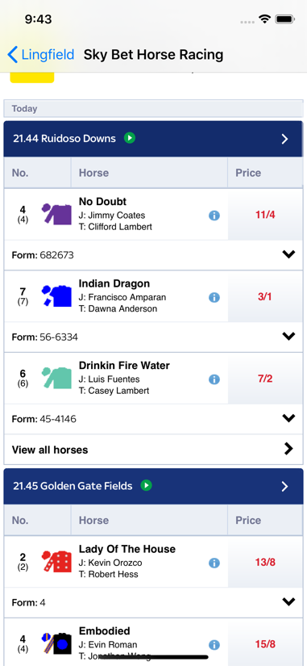

# horse-racer App

# Description
The horse-racer app is a simple application that allows users to navigate current horse races. Users can find the race they are interesting in and then from there navigate to the Sky Bet website.

## Features
- Dark Mode, the app will automatically adjust the colors it uses in accordance with the user's theme preferences.
- Horse sorting, the app allows users to sort the horses in a given race by cloth or best odds so that they can see horses in the order they choose.

## Accessibility

- The app uses Dynamic Type so that its textual content can grow and shrink in size in accordance with the users preferences. (See screenshots for example)
- The app make use of accessibility labels so that Voice Over users can still navigate the app an know what is happening on screen.

## Requirements
- macOS 10.15 Catalina
- Xcode 11
- iOS 13
- Swift Version 5

## Assets Used
Horse Logos Free - ClipArt Best
http://www.clipartbest.com/horse-logos-free

## Screenshots
App Launch Screen

### Race List Screen Light

### Race List Screen Dark

### Race Info Screen

### Race Web View

### Race Info Screen Accessibility (Large Text)
")
